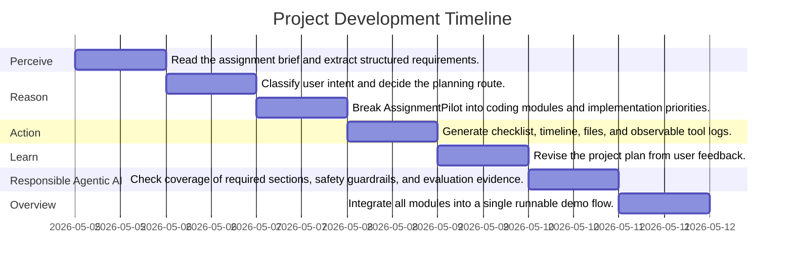

# CA6123 AssignmentPilot Project Timeline

## Visual Progress (Mermaid Gantt)

## Detailed Schedule
| Phase | Owner | Priority | Core Task Description | Output |
|---|---|---|---|---|
| **Perceive** | Member 1 | High | Read the assignment brief and extract structured requirements. | AssignmentRequirement data for downstream agents |
| **Reason** | Member 2 | High | Classify user intent and decide the planning route. | Intent label such as coding_plan or task_allocation |
| **Reason** | Member 2 | High | Break AssignmentPilot into coding modules and implementation priorities. | Structured project plan and coding task breakdown |
| **Action** | Member 3 | Medium | Generate checklist, timeline, files, and observable tool logs. | Markdown plan, CSV task table, and JSON demo log |
| **Learn** | Member 4 | Medium | Revise the project plan from user feedback. | Simplified or adjusted plan based on feedback history |
| **Responsible Agentic AI** | Member 4 | High | Check coverage of required sections, safety guardrails, and evaluation evidence. | Compliance report and evaluation summary |
| **Overview** | Member 1 | High | Integrate all modules into a single runnable demo flow. | End-to-end command line demo |
